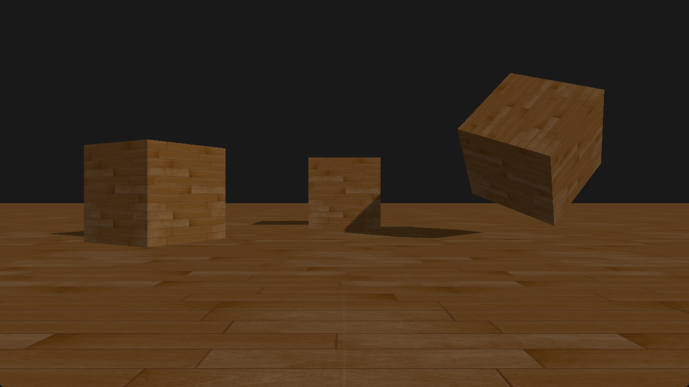
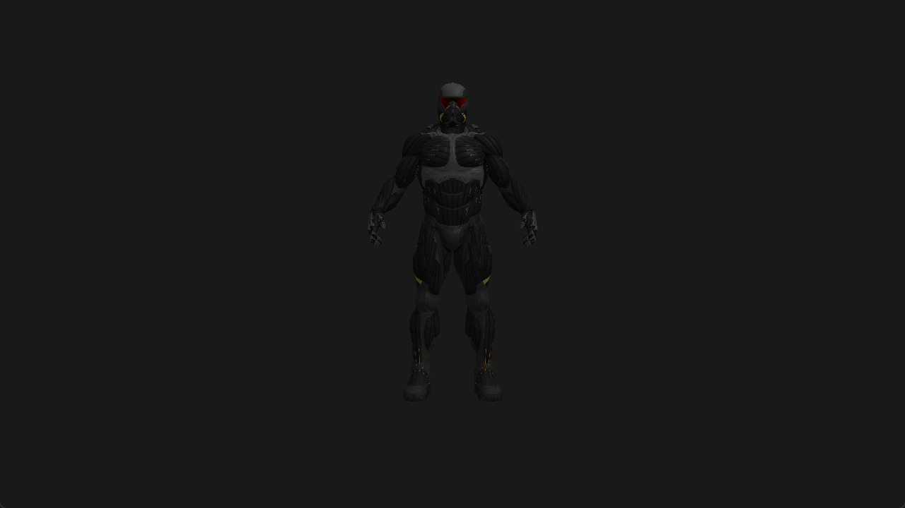

# 3D渲染引擎

## 项目介绍

本项目是一款基于OpenGL的三维渲染引擎，目前已经实现天空盒、Blinn-Phong光照、阴影映射、模型加载和骨骼动画等功能。项目使用C++面向对象思想进行封装，定义了简洁易用的接口，用户可以使用本引擎搭建自己的3D应用。

## 项目展示

<video src="assets/JBEngine window 2025-02-10 20-53-46.mp4"></video>



<video src="assets/JBEngine window 2025-02-10 20-56-57.mp4"></video>

## 简单示例

```C++

#include <iostream>
#include <chrono>
#include "../../engine/render/render.h"
#include "../../engine/camera/perspectiveCamera.h"
#include "../../engine/model/assimpLoader.h"

using namespace JB;

uint32_t WIDTH = 1280;
uint32_t HEIGHT = 720;

int main()
{

	// 创建相机
	PerspectiveCamera::Ptr camera = PerspectiveCamera::create(glm::radians(45.0f), (float)WIDTH / (float)(HEIGHT), 0.1f, 100.0f);

	// 加载模型
	auto model = AssimpLoader::load("resources/nanosuit/nanosuit.obj");
	model->object3D->setPosition(0, -7, -30);

	// 创建定向光
	auto dirLight = std::make_shared<DirectionalLight>();
	dirLight->setAmbient(glm::vec3(0.5f, 0.5f, 0.5f));
	dirLight->setDiffuse(glm::vec3(0.3f, 0.3f, 0.3f));
	dirLight->setSpecular(glm::vec3(0.2f, 0.2f, 0.2f));
	dirLight->setPosition(-10, -10, -10);

	// 创建场景
	Scene::Ptr scene = Scene::create();
	scene->addChild(model->object3D);
	scene->addChild(dirLight);

	// 创建渲染器
	Renderer::Descriptor rDc;
	rDc.width = WIDTH;
	rDc.height = HEIGHT;
	Renderer::Ptr renderer = Renderer::create(rDc);
	renderer->init();
	renderer->setClearColor(0.1f, 0.1f, 0.1f, 1.0f);

	while (true)
	{
		if (!renderer->render(scene, camera))
		{
			break;
		}
		renderer->swap();
	}

	return 0;
}
```

效果：

